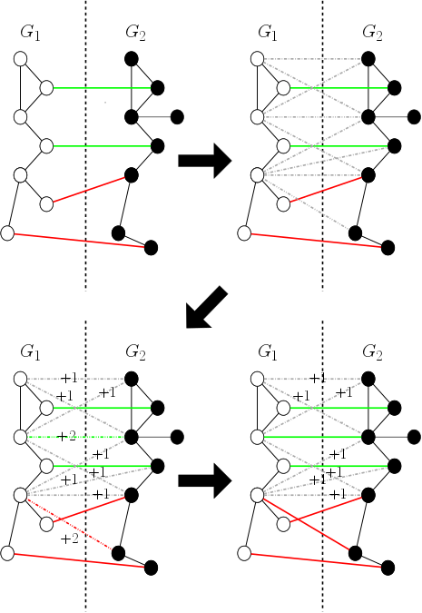

### Distributed NoisySeeds ###
A map-reduce implementation of the NoisySeeds algorithm as described in the paper of kazemi et al. "Growing a graph from a handful 
of seeds". The Distributed NoisySeeds (DiNoiSe) algorithm works upon a cluster of commodity hardware algorithm whilst following 
the same logic as the original NoisySeeds algorithm. This implementation is written in PySpark (Python API for Apache Spark).

An addition to this implementation is an experimental seed generation algorithm for the purpose of solving the problem of finding 
side information named SeedGenerator (SeGen) algorithm. SeGen is an adaptation to the Weisfeiler-Lehman graph isomorphism 
1-dimensional test for graphs (also known as Naive Vertex Refinement).


<br/>


### Background ###
The NoisySeeds is a Percolation Graph Matching (PGM) algorithm. PGM algorithm have been made with the purpose of acquiring an 
approximate solution to the graph matching problem. A common use of these algorithms is Network de-anonymization. More 
specifically, the algorithm can find shared users between two networks, which have been anonymized.




<br/>


### Motivation ###
* Graph data which represent social netowrks are massive therefore the computations required from percolation graph matching can become prohibitive even for contemporary hardware.

* A PGM algorithm will require an initial set of pre-acquired connections (named seeds). The problem is that finding a priori 
knowledge can be demanding and often requires the human factor. An automatic system for finding initial knowledge can eliminate all 
possible difficulties.


<br/>


### Instructions ###
You can use the dinoise algorithm with the help of an isolated instance of python3

<details>
 
 <summary>Set the python environment</summary>

  * clone project `git clone https://github.com/chdavalas/distributed_noisy_seeds.git`<br/>
  
  
  * change directory to project folder `cd my/projects/directory/distributed_noisy_seeds`<br/>
  
  
  * ensure python-pip has been installed `sudo apt-get install python3-pip`<br/>
  
  
  * ensure virtualenv has been installed `pip3 install virtualenv`<br/>
  
  
  * create new python3 environment with virtualenv `which python3; virtualenv -p {my/python3/directory} {environment_name}`<br/>


  * activate environment `source {environment_name}/bin/activate`<br/>
  
  
  * install suggested requirements and check if properly installed `pip3 install -r requirements.txt; pip3 freeze`<br/>

</details>


<details>
 <summary>Run tests</summary>
  
  * run testing script and check data
  ```
  spark-submit --master local[*] testing_script.py \
               --input /test_data/[graph]/G1/{part-*.gz} /test_data/[graph]/G2/{part-*.gz} \
               --input_seeds /test/data/[graph]/seeds/{*.gz} \
               --bucketing (use the flag if you want to use DiNoiSe with bucketing) \
               --seeds (use the SeGen algorithm by setting the number of seeds you wish. Note that in this case, you should NOT use the "--input seeds" argument) \
               --parts (Apache Spark partitions)
   ```
   
   ```
   cat results_log.csv; cat seeds_log.csv
   ```
</details>

<details>
 <summary>Run DiNoiSe with you own data</summary>
  
  * Run DiNoiSe
  ```
  spark-submit --master local[*] {dinoise.py OR dinoise_w_bucketing.py} \
               --input {my/graph1/dir} {my/graph2/dir} \
               --input_seeds {my/seeds/dir} \
               --output_dir {my/output/dir}\
               --seeds (use the SeGen algorithm by setting the number of seeds you wish. Note that in this case, you should NOT use the "--input seeds" argument) \
               --parts (Apache Spark partitions)
   ```

   * Check for output
   ```
   ls my/output/dir; 
   ```
   
   * Read part of seeds and a part of matchings
   ```
   head my/output/dir/segen_seeds/part-*
   ```
   ```
   head; my/output/dir/{seeded_matching OR seedless_mathcing}/part-* 
   ```
</details>


### Citation ### (Thanks in advance for citing us :) )
--Forthcoming--
